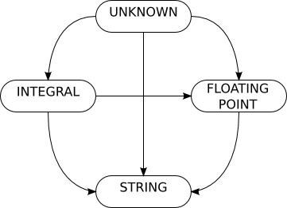

============================================================================
ABOUT
============================================================================

This is a library for parsing, validation and limited preprocessing of 
Mixed-Type Matrices represented in tab-separated ASCII text form.

Rows are considered to represent features (variables), and columns contain
samples. That is, each row contains the values of one variable in many
samples, and each column contains all the variables (features) measured
for one sample. Thus, each row (line) necessarily contains data of one
type and one statistical class.

The input matrix can optionally include a row of column labels and a column
of row labels.

The data in each row of the input matrix is assumed to represent one of four
canonical *statistical classes*:

	1. boolean
	2. categorical
	3. ordinal (Note: All references to "ordinal" below refer to planned
			future functionality; currently there are only 3 classes.)
	4. continuous

The matrix is parsed and converted to a memory-resident binary form 
consisting *entirely* of either 32-bit or 64-bit values: floats and 
unsigned ints (the 32-bit form) or doubles and unsigned longs (64-bit). 
The library is compiled for one of the two forms; they are currently
mutually exclusive.

**This library currently implements Unix line conventions:
lines are expected to end with a single newline (012) character.
Presence of carriage return (015) characters as used in Windows and (old) 
Apple OSes may cause unexpected results.**

^^^^

============================================================================
MATRIX FORMAT in detail
============================================================================

*Every* line of the input file must be one of four types:

	1. column names
	2. empty (formally consisting of just the line terminator)
	3. a comment line if the *first character* is the comment 
	   prefix (# by default, see below)
	4. data

Empty lines are permitted and silently ignored.

Lines beginning with '#' are treated as comments and silently ignored.
A different comment indicator may be set by defining the environment 
variable "MTM_COMMENT_CHAR". The first character of this variable will be
used as the comment flag.

----------------------------------------------------------------------------
Separated Values
----------------------------------------------------------------------------

Every data line as well as the column names line (if present) must contain 
fields *separated* by tab characters (ASCII 9) by default. 
"Separated" means a field is *assumed* to exist on both sides of *every* 
tab character.  Separators are not *coalesced* the way some programs coalesce 
whitespace; every separator is significant.
An implication of this is that **adjacent separators imply empty fields** or 
missing data. 
For example a line consisting only of three tabs ("\\t\\t\\t\\n") will be
interpreted as four empty fields.

All data and header (column name) lines must contain the same column count.
Because of the way separators are interpreted this means every non-blank, 
non-comment line must contain the same count of separator characters.

The separator may be changed by defining the 
environment variable MTM_SEPARATOR_CHAR. 

----------------------------------------------------------------------------
Missing Data
----------------------------------------------------------------------------

Missing data is represented by a distinguished marker symbol specified to 
the mtm_parse API as a regular expression. The default is /[Nn][Aa][Nn]?/.
Obviously, this marker should be entirely distinct from all valid data.

Empty fields are an alternative and permissable way to represent missing
data. 

----------------------------------------------------------------------------
Header/Column Labels
----------------------------------------------------------------------------

If column labels are present they must occupy the first non-blank, 
non-comment row. They are ignored (and discarded) by the parser. In 
particular, they are not available to client software.

----------------------------------------------------------------------------
Data
----------------------------------------------------------------------------

The matrix can include floating-point, integer, and symbolic (string) data.
Integer data can be represented in octal, decimal, or hexadecimal following 
standard (C language) conventions.

Categorical data in the input can be represented as non-negative integers or 
symbolically. Symbolic category names are implicitly mapped to integer 
identifies in the resulting binary matrix and the category labels are
discarded.

Each data line may contain as its *first field* a row label. This field
can contain arbitrary information since, except as noted below, it is
ignored by the parser. It must be separated from the following data by
the separator character (tab, by default) as if it was data.

----------------------------------------------------------------------------
Row Labels
----------------------------------------------------------------------------

If row labels are present they must occupy the first (leftmost) column.

Row labels can optionally encode the intended statistical class of rows. 
If row labels encode the statistical class, a C language callback function 
may be provided to parse the type information. (See the mtm_parse function
in the library header file.)

The MTM library itself provides a default function that allows the 
statistical class of a row to be encoded as a prefix of the row label.
The use of this function is entirely optional. (See below.)

^^^^

============================================================================
DATA INTERPRETATION, REPRESENTATION, and ENCODING
============================================================================

Statistical software must distinguish between three different aspects of
data which are often conflated:

	 1. the statistical interpretation that will be used for a data
   		vector, here referred to as its *statistical class*
	 2. the *type* of the scalar values in the data vector (implied by 
		its *representation* in a textual data file)
	 3. the binary encoding of those values (in RAM at runtime)

On the basis of:

	1. the *cardinality* of possible scalar values
	2. whether or not the values are naturally ordered (or order-*able*).
	3. whether or not *magnitudes* and *intervals* between values matter.

.. The *cardinality* is related to "measure" of the space.

...one can distinguish 4 statistical classes ...

	1. **boolean** : cardinality is 2, may be ordered or unordered
	2. **categorical** or **nominative** : finite (and few!) *unordered* values
	3. **ordinal** : finite (possibly large) cardinality, ordered values
					By definition neither magnitudes nor the intervals
					between values are relevant.
	4. **continuous**, **numerical**, or **quantitative** : infinite and ordered
					Cardinality of unique values in a sample of size N may 
					approach N. Magnitudes and intervals matter.

.. ===========   =====================   ===========================================
.. STATISTICAL   BINARY                  TEXT
.. CLASS         ENCODING                REPRESENTATION
.. ===========   =====================   ===========================================
.. boolean       0 and 1 integers        {"true","false"}, {T,F},{0,1},{-,+},etc.
.. categorical   small natural numbers   integer values or string labels
.. ordinal       natural numbers         integer values in [1...n], n <= sample size
.. continuous    floats                  floating-point
.. ===========   =====================   ===========================================

The relationships between the classes are succinctly captured in a Venn diagram:

.. image:: ./doc/featureclass.png

All statistical classes except continuous are encoded as non-negative integers 
in the binary form. 
Continuous data are represented as floats (or doubles).
Class labels in categorical data are discarded (after the labels are converted
to integral values); they are not available in any output of this library.

^^^^

========================================================================
General observations on data representation
========================================================================

Ordinal is typically associated with ranks in which cardinality
equals sample size (unless there are ties).
Ordinal-categorical hybrids are possible--that is, a natural ordering 
may exist between the labels in categorical data, but choosing to treat
it as categorical ignores this ordering.
An order can always be imposed on two values, so boolean data is
always orderable.

Categorical data may be represented in any fashion at all--even as
floating point values--provided the cardinality of the set of unique 
values is small. And "small" typically means *much smaller than sample 
size*. 
However, categorical is canonically represented 
by string labels or small non-negative integral values ("levels").

Ordinal could be represented by arbitrary numeric values (especially
as continuous data can always be demoted to ordinal by rank), but
ordinal is canonically integers in [0,n) with n <= sample size.
Floating-point numbers certainly *could* represent ordinal data, but
use of floating-point implies magnitude matters.

The above considerations demonstrate that
**the statistical class is not uniquely determined by the
type of the data, nor is the type dictated by statistical class**.
When class is specified conventions dictate the type.
When class is unspecified conventions allow inferrence of a reasonable
Each merely constrains the other.
When statistical class (intent) is known, it can drive an interpretation
of data, and when class is unknown it can be sensibly inferred from
from data type and heuristics or conventions.

This library implements the following rules to interpret data.

========================================================================
Constraining type interpretations by statistical class
========================================================================

A callback can be provided to the mtm_parse API that interprets 
statistical intent coded in row labels. The function receives a
const char \* pointer to the row label and must return one of the
STAT_CLASS\_\* constants. See the relevant header file.

For the purposes of parsing, what a field *contains* is less important 
than how it is *treated.* If we expect:

===========  ===============================================================
Expect       Requirements
===========  ===============================================================
boolean      Fields are treated as integers if possible (to preserve 
             implicit order) Otherwise they are treated as strings.
categorical  Fields are treated as strings regardless of their content.
ordinal      Fields are required to contain integral data.
continuous   Fields are treated as floats. (Of course, integers are 
             always parseable as floats.)
===========  ===============================================================

A default function is also provided by the library that uses the first 
character of each row label as a flag. (See the header file(s).)

======== ====================
1st char Statistical class
======== ====================
B        boolean
C or F   categorical (factor)
D or O   ordinal
N        continuous
======== ====================

The first *two* characters must match the regular expression 
/[BCDFNO][:punct:]/, otherwise "unknown" is returned.

========================================================================
Inferring statistical class from type
========================================================================

Because by definition each row contains data of *one* type, then,
whatever the syntactic *representation*, it must be possible to infer
the type from the text.
The _parseLine function inspects each field in turn and interprets that
field in the most restrictive way possible: integral, floating-point, or
string. By considering each field in turn it transitions through the
following state machine:

...ultimately arriving at one inferrence for the data *type* of that row.

Missing-data indicators (or empty fields) never cause a transition.

Note that integer values can occur in otherwise floating-point data.
If, for example,
a row begins with integer values, but a decimal value appears later in
the row the interpretation of the whole row changes. Similarly, if early
values appear to be numeric (integer or floating point) but a value 
(other than the missing value indicator) appears that can not be 
interpreted numerically, then the whole row becomes string-valued.

As described above, however, this does not uniquely determine the
*statistical class*.

1. Non-numeric string/symbolic data *necessarily* implies categorical data
2. Numeric data is implicitly "at least" ordered, and as cardinality
   approaches sample size , it is less and less plausibly categorical.
   Notice cardinality equals sample size for rank data.
   Boolean (categorical) data represented as 0 and 1 implies an ordering
3. Floating-point (numeric data involving decimal points and/or 
   exponential notation) implies continuous, though if cardinality is
   very low, it may also be categorical or ordinal.
   Floating point data 

These are only conventions. For example, floating-point data *could* be
treated as categorical if its cardinality is not only small (<32) but also
much less than the sample size. It is not the intent of this library to
embody too much "cleverness" with respect to statistical modeling.
Furthermore, the magnitudes of continuous *can* always be ignored and the
data treated as merely ordinal.
The statistical class *ought* usually to be encoded in row labels!
..	Relation between range (or max value), cardinality, and sample count
..	can be used to infer a sensible statistical class.

Most importantly, if a function for interpreting statistical class is
provided that class will *always* constrain the interpretation of type
(possibly resulting in parse errors). If class is not dictated this way,
it is inferred from type subject to the following rules:

The following describes built-in *conventions* that derive statistical
class from type:

1.	string types are either categorical or boolean depending on cardinality
2.	integer types are ordinal
3.	floating-point types are numeric

..	Must explicate the two cases: statistical-class specified or inferred.
..  I:integral, S:string, F:floating-point
..	boolean     => {I,S}
..	categorical => {I,S}
..	ordinal     => {I}
..	numeric     => {F}

..	The parser makes exactly one pass over the data; there is no backing up.
..	The parser attempts to preserve natural ordering when possible, so
	strings representing integer values those values are preserved even
	when a categorical class is dictated. No, not true, because the 

..	Best-practice: never use numbers for genuinely categorica/nominative data.

^^^^

============================================================================
BUILDING
============================================================================

Dependencies:
	http://www.isthe.com/chongo/tech/comp/fnv/index.html

^^^^

============================================================================
TESTING
============================================================================

TODO.

^^^^

============================================================================
USAGE
============================================================================

TODO.

^^^^

============================================================================
LIMITATIONS
============================================================================

============================================================================
OPEN ISSUES/TODO/WISHLIST
============================================================================

============================================================================
DESIGN
============================================================================

The library has been design for efficiency. Specifically, only one pass is
made over any of the data.

