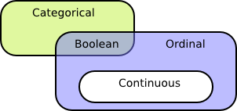

============================================================================
ABOUT
============================================================================

This is a library for parsing, validation and *limited* preprocessing of 
*mixed-type* data matrices represented in tab-separated ASCII text form.

Rows are considered to represent features (variables), and columns contain
samples. That is, each row contains the values of one variable in many
samples, and each column contains all the variables (features) measured
for one sample.

The input matrix can optionally include a row of column labels and a column
of row labels.

The data in each row of the input matrix is assumed to represent one of four
canonical statistical classes:

	1. boolean
	2. categorical
	3. ordinal
	4. continuous

The matrix is parsed and converted to a memory-resident binary form (following C
language conventions) consisting *entirely* of either floats and 
unsigned ints (the 32-bit form) or doubles and unsigned longs (64-bit). 
The library is compiled for one of the two forms; they are currently
mutually exclusive.

**This library currently implements Unix line conventions:
lines are expected to end with a single newline (012) character.
Presence of carriage return (015) characters as used in Windows and (old) 
Apple OSes may cause unexpected results.**

^^^^

============================================================================
MATRIX FORMAT in exhaustive (and exhausting) detail
============================================================================

Every line of the input file is one of four types:
	1. column names
	2. empty (formally consisting of just the line terminator)
	3. a comment line if the *first character* is the comment 
		prefix (# by default, see below)
	4. data

Empty lines are permitted and silently ignored.

Lines beginning with '#' are treated as comments and silently ignored.
A different comment indicator may be set by defining the environment 
variable "MTM_COMMENT_CHAR". The first character of this variable will be
used as the comment flag.

----------------------------------------------------------------------------
*x*-separated Values
----------------------------------------------------------------------------

Every line of the input file (except blank lines and comments) must contain 
*x*-separated fields, where *x* is the tab character by default. 
"Separated" means a token is assumed to exist either side of *every* 
separator.  Separators are not *coalesced* the way some programs coalesce 
whitespace; every separator is significant.
An implication of this is that adjacent separators imply *empty fields* or 
missing data. 
For example a line consisting only of three tabs ("\\t\\t\\t\\n") will be
interpreted as four empty fields.

All data and header (column name) lines must contain the same column count.
Because of the way separators are interpreted this means every non-blank, 
non-comment line must contain the same count of separator characters.

The separator may be changed by defining the 
environment variable MTM_SEPARATOR_CHAR. 

----------------------------------------------------------------------------
Missing Data
----------------------------------------------------------------------------

Missing data is represented by a distinguished marker symbol specified to 
the mtm_parse API as a regular expression. The default is /[Nn][Aa][Nn]?/.
Obviously this marker must be entirely distinct from all valid data.

Empty fields are an alternative and permissable way to represent missing
data. 

----------------------------------------------------------------------------
Header/Column Labels
----------------------------------------------------------------------------

If column labels are present they must occupy the first non-blank, 
non-comment row. They are discarded by the parser.

----------------------------------------------------------------------------
Data
----------------------------------------------------------------------------

The matrix can include floating-point, integer, and symbolic (string) data.
Integer data can be represented in any standard base (octal, decimal, 
or hexadecimal) following standard conventions.

Categorical data in the input can be represented as non-negative integers or 
symbolically, but symbolic category names are implicitly mapped to integer 
identifies in the resulting binary matrix and the category labels are
discarded.

Each data line may contain as its *first field* a row label. This field
can contain arbitrary information since, except as noted below, it is
ignored by the parser.

----------------------------------------------------------------------------
Row Labels
----------------------------------------------------------------------------

If row labels are present they must occupy the first (leftmost) column.

Row labels can optionally encode the intended statistical class of rows. 
If row labels encode the statistical class a C language callback function 
may be provided to parse the type information.

One such function is provided by the library itself. (See below.)

^^^^

============================================================================
DATA INTERPRETATION, REPRESENTATION, and ENCODING
============================================================================

Statistical software must distinguish between three different aspects of
data which are often conflated:

	 1. the (statistical) *intent* of a feature vector 
	 2. the *syntactic* representation of its scalar values (in an input)
	 3. the (C language, binary) encoding of those values in RAM at runtime

Considering...

	1. the *cardinality* of possible scalar values (the measure-theoretic 
	   "support") and
	2. whether or not its values are *naturally ordered*
	3. whether or not *absolute values* and *intervals* between values matter

...yield four canonical statistical classes...

===========   =====================   ===========================================
STATISTICAL   BINARY                  TEXT
CLASS         ENCODING                REPRESENTATION
===========   =====================   ===========================================
boolean       0 and 1 integers        {"true","false"}, {T,F},{0,1},{-,+},etc.
categorical   small natural numbers   integer values or string labels
ordinal       natural numbers         integer values in [1...n], n <= sample size
continuous    floats                  floating-point string
===========   =====================   ===========================================

...with the following definitions...

	1. **boolean** : cardinality is 2, may be ordered or unordered
	2. **categorical** : finite (and few!) *unordered* values
	3. **ordinal** : finite (possibly large) cardinality, ordered values
					By definition neither absolute values nor the intervals
					between values are relevant.
	4. **continuous** : infinite and ordered
					Cardinality of unique values in a sample of size N may 
					approach N. Absolute values and intervals matter.

The relationships between the classes are succinctly captured in a Venn diagram:

All statistical classes except continuous are encoded as non-negative integers 
in the binary form. 
Continuous data are represented as floats (or doubles).
Class labels in categorical data are discarded (after the labels are converted
to integral values); they are not available in any output of this library.

^^^^

========================================================================
General observations on data representation
========================================================================

Ordinal is typically associated with ranks in which cardinality
equals sample size. Ordinal-categorical hybrids are possible--that
is, a natural ordering may exist between the labels in categorical
data (e.g. as in some boolean).

Categorical data may be represented in any fashion at all--even as
floating point values--provided the cardinality of the set of unique 
values is small. And "small" typically means *much smaller than sample 
size*. 
However, categorical is canonically represented 
by string labels or small non-negative integral values ("levels").

Ordinal could be represented by arbitrary numeric values (especially
as continuous data can always be demoted to ordinal by rank), but
ordinal is canonically integers in [0,n) with n <= sample size.
Floating-point numbers certainly *could* represent ordinal data, but
use of floating-point implies absolute value matters.

The above considerations demonstrate that
**in software the statistical class cannot be absolutely inferred from 
syntax, nor is representational syntax strictly implied by class**, 
but each *constrains* the other. 
When statistical class (intent) is known, it can drive an interpretation
of data, and when class is unknown reasonable classes can be motivated
by syntax.

This library implements the following rules to interpret data.

========================================================================
Constraining syntax with class
========================================================================

A callback can be provided to the mtm_parse API that interprets 
statistical intent coded in row labels. The function receives a
const char \* pointer to the row label and must return one of the
STAT_CLASS\_\* constants. See the relevant header file.

For the purposes of parsing, what a field *contains* is less important 
than how it is *treated.* If we expect:

===========  ===============================================================
Expect       Requirements
===========  ===============================================================
boolean      Fields are treated as integers if possible (to preserve 
             implicit order) Otherwise they are treated as strings.
categorical  Fields are treated as strings regardless of their content.
ordinal      Fields are required to contain integral data.
continuous   Fields are treated as floats. Note that integers are 
             parseable as floats.
===========  ===============================================================

A default function is also provided by the library that uses the first 
character of each row label as a flag. (See the header file(s).)

======== ====================
1st char Statistical class
======== ====================
B        boolean
C or F   categorical (factor)
D or O   ordinal
N        continuous
======== ====================

========================================================================
Inferring class from syntax
========================================================================

1. Non-numeric string/symbolic data *necessarily* implies categorical data
2. Numeric data is implicitly "at least" ordered, and as cardinality
   approaches sample size , it is less and less plausibly categorical.
   Notice cardinality equals sample size for rank data.
   Boolean (categorical) data represented as 0 and 1 implies an ordering
3. Floating-point (numeric data involving decimal points and/or 
   exponential notation) implies continuous, though if cardinality is
   very low, it may also be categorical or ordinal.

^^^^

============================================================================
BUILDING
============================================================================

Dependencies:
	http://www.isthe.com/chongo/tech/comp/fnv/index.html

^^^^

============================================================================
TESTING
============================================================================

^^^^

============================================================================
USAGE
============================================================================

^^^^

============================================================================
LIMITATIONS
============================================================================

============================================================================
OPEN ISSUES/TODO/WISHLIST
============================================================================

============================================================================
DESIGN
============================================================================

The library has been design for efficiency. Specifically, only one pass is
made over any of the data.

