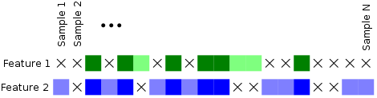

============================================================================
ABOUT
============================================================================

This is command-line software for performing (relatively) rapid pairwise 
analysis of *mixed-type* covariate data to identify *associations* between 
covariates.

The prototypical kind of association is (Pearson) correlation, but Pearson 
correlation is, in fact, only one of a wide variety of statistical tests
that can be used to establish that two variables ("features") are related.
This program implements a selection of tests and automatically chooses
the appropriate test for a given pair of covariates. It also carries out
a number of other processes on data to increase the efficacy of the
statistical tests.

This software has three high-level functions:

	1. (Optionally) select pairs of features (rows from the input matrix)
	   specified in one of several ways by the command line.
	   By default it iterates through *all* pairs.
	2. For every pair of features it chooses and executes a statistical test 
	   according to the features' statistical classes (boolean, categorical, 
	   ordinal, continuous).
	3. Report a configurable amount of information on each test in either
	   tabular or (soon) JSON format subject to configurable filters.
	   Output filters include the option of Benjamini-Hochberg FDR conrol.

Every run of pairwise involves these function, but the exact behavior
is under the control of *many* options, some described herein some 
described only in the online help.

Input consists of textual matrices of tab-separated values in which
rows represent features and columns represent samples. See the libmtm
project in a neighboring directory tree for thorough documentation of 
input options and constraints as well as rationales behind the "statistical
classes" mentioned above.

**In the interest of minimizing stale and out-of-sync documentation functionality
that is thoroughly documented in the command-line executable's help text is not
repeated here.**

^^^^

============================================================================
STATISTICS
============================================================================

Three separate statistics are computed for each pair of features.
One of the following is calculated *between* the features using only 
those samples present in both features.

======================= ================================
Features                Statistic
======================= ================================
categorical/categorical Chisquare or Fisher Exact
categorical/numerical   Kruskal-Wallis
numerical/numerical     Spearman correlation
======================= ================================

Kruskal-Wallis is a non-parametric analog of 1-way ANOVA, 
which is approximately Chi-square distributed. The Spearman
correlation is the same as Pearson correlation but is calculated
on the ranks, not actual values, of the data.

Additionally, *within* each feature (F) the Kruskal-Wallis statistic is calculated 
between the samples of F present in both and samples present in F but missing in "the other."
For example, in the figure below where 'X' indicates missing data, 
the Kruskal-Wallis statistic is calculated in Feature 1 
between the light green and dark green samples and in Feature 2 between the light
blue and dark blue samples. The primary statistic (whichever of the above is used)
is calculated between the dark blue and dark green.

The K-W statistic *within* each feature provides some indication of whether 
the statistical result *between* the features was skewed by missing data.

The Spearman correlation is calculated for all pairs involving ordered
data. This obviously includes continuous pairs, but it also includes
categorical data with only two categories (i.e. boolean) since two categories
are always orderable (implicitly or otherwise). In other words, the Spearman
correlation is computed as long as one of the features is *not* strictly 
categorical with more than 2 categories. The absolute value of the Spearman 
correlation in some cases may not be meaningful, but its sign is.

The case where both features are categorical is slightly more
complex. In the interest of having statistically "good" tables
a preprocessing step is performed in which rows and/or columns
with empty cells are removed in such a way as to minimize the
total loss of samples. The approach, however, is greedy and not
guaranteed to be optimal. If after this "culling" step either of
the table's dimensions exceeds 2, a Chi-Square test is performed. 
Otherwise, if the table is 2x2, the Fisher exact test is performed.

**Contingency table cleaning going to be revised/supplemented by univariate outlier
detection and/or class balancing in the near future.**

^^^^

============================================================================
OUTPUT (FILTERING AND FORMATTING)
============================================================================

The *content* and *format* of output are *independently* configured.
Ouput is provided in one of two overarching formats: tabular and JSON_.
The "local" formatting of certain fields is also specifiable as noted
below.

.. _JSON : http://json.org

----------------------------
Content filtering
----------------------------

Every pair analysis produces 17 items of data, any or all of which
can be reported. You can select items for reporting as well as
specify the order by passing a "format specifier string" as the
argument of the -f (or -J) option on the command line. See online
help.

A format specifier is essentially a whitespace separated series of descriptive
identifiers or identifier *prefixes* as described in the tables below. 
*Any type* and *any amount* of whitespace (space, newline, tab) can separate 
each token, and tokens must not contain any whitespace.
If prefixes are used, the prefix need only be enough to uniquely identify
the intended identifier. Regular expression matches enforce this.

Some data are associated with the "left" and "right" features (e.g. 
feature names); others are associated with the covariate pair. Data
with left/right association are also independently specified by 
prefixing the identifier with '<' and/or '>'.

=========================== ==================================
Covariate information       Identifier regular expression
=========================== ==================================
sample count                c(ount)? [1]_
statistic name              st(at)?
statistic value             v(alue)?("[2]_")?
test error                  e(rror)? [3]_
sign of correlation         si(gn)?("[2]_")? [4]_ 
p-value                     p(rob)?("[2]_")?
-log10(p-value)             P(rob)?("[2]_")?
extra info                  e?x(tra)? [5]_
=========================== ==================================

=========================== ================================
Univariate information      Identifier regular expression 
=========================== ================================
feature name                [<>]{1,2}f(eature)?
feature offset              [<>]{1,2}o(ffset)?
feature statistical class   [<>]{1,2}cl(ass)?
preprocessing description   [<>]{1,2}pre(proc)?
count of unused values      [<>]{1,2}u(nused)?
statistic name              [<>]{1,2}s(tat)?
statistic value             [<>]{1,2}v(alue)? [2]_
p-value                     [<>]{1,2}pro(b)? [2]_
extra info                  [<>]{1,2}e?x(tra)?
=========================== ================================

.. [1] The number of covariate *pairs* analyzed. This is the number
       of pairs in which *neither* value was missing.

.. [2] A printf-style format string valid for a floating-point value 
       delimited by double quotes. This must match the regular
       expression: /%[-#0+]?([1-9][0-9]*)?(.[0-9]*)?[eEfFgG]"/.
       This is a *restricted* version of the printf format
       for floating-point values.

.. [3] A 2-character hexadecimal value reporting the bit 
       flags of the test. See online help.

.. [4] Currently the Spearman rho. In the future it will be
       +1.0 or -1.0 according to the sign of the correlation.
       Correlation value is also reported as the statistic value
       for continuous-continuous feature pairs.

.. [5] A loosely structured string consisting of any additional
       information made available by the statistical test (e.g. number of
       ties in rank data, or number of empty cells in a contingency table).

For example, "<>f p%.3f" specifies printing of *both* feature names
as well as the covariate p-value with 6 decimal places. Given a 
single 'p' as the argument to the --format option causes pairwise
to emit nothing but the covariate p-value.

**Some fields are not yet implemented, and will report as much if used.**

----------------------------
False discovery rate control
----------------------------

Coming soon...

^^^^

============================================================================
BUILDING
============================================================================

Dependencies:
	1. GNU Scientific Library (GSL_) 
	2. Lua_ is an optional dependency

Update the Makefile's GSLINC and GSLLIB variables with the location of
GSL's headers and libraries on your system.

Running::

	make
	
...in the src directory on a Linux machine with a suitable 
development environment builds the pairwise executable. 

.. _GSL: http://www.gnu.org/software/gsl
.. _Lua: http://www.lua.org

^^^^

============================================================================
TESTING
============================================================================

C code is structured as much as possible in unit-testable modules.
All unit testable C code has a conditionally compiled main() in its tail
to facilitate unit testing. See the relevant files and Makefile.
The unit tests are not automated; they are command line apps that are
intended for manual verification.

A blackbox testing framework is also provided in test/blackbox.
The exec.py script in test/blackbox:

	1. generates random data in R 
	2. analyzes the data in R
	3. compares the results of the two data paths.

It is run simply as::

	python3 exec.py <# of tests to perform>.

Note that for the case of categorical/categorical covariates
this involved a non-trivial reimplemention in R of the C++ "culling" code
in cat.cpp

^^^^

============================================================================
USAGE
============================================================================

Run the pairwise as::

	./pairwise yourdata.tab 

Many command line options are available. Run pairwise with no arguments.

^^^^

============================================================================
LIMITATIONS
============================================================================

1. No categorical feature may have more than 32 categories.

^^^^

============================================================================
OPEN ISSUES/TODO/WISHLIST
============================================================================

----------------------------------------------------------------------------
Reporting/filtering/counting of tests
----------------------------------------------------------------------------

Computation of statistics can fail for a variety of reasons related to
degeneracies in the input data. Some of these can be detected early (before
computation begins); some only become apparent in the coarse of computation.

Handling of degeneracies is furthermore bound up with three different
requirements that are somewhat at odds:

	1. maximizing useful output, "useful" being context-dependent.
	2. the need to filter output (i.e. to avoid a combinatoric explosion
	   of "uninteresting" results)
	3. the need to count *actually-performed* tests (for FDR control)

The typical sparsity of "interesting" results in the N-choose-2 possibilities
demands some in-program filtering (as opposed to simply piping the output
through a shell filter like awk), but there are multiple ways one
might filter. Only p-value filtering is currently available.

The need to support FDR control requires clear distinction between tests
*not performed* (e.g. because of early degeneracy detection) and failed
tests.

Proper handling of these issues is not fully resolved in the current 
implementation. 

Currently, NaNs are *intentionally* allowed to propagate to output; this is 
not a bug.

============================================================================
DESIGN
============================================================================

----------------------------------------------------------------------------
Goals
----------------------------------------------------------------------------

This software began as a reimplementation of an existing pipeline.
The requirement for compatibility with the prototype drove much
of its design.

The original program was motivated by one goal: speed. ..specifically, 
fast calculation of the several standard statistics describe above
on input with significant amounts of missing data. 

It was originally intended strictly for *exhaustive pairwise batch 
processing*.  Everything that deviates from this, e.g. row subselection, is 
an afterthought/add-on.

The goal of speed is approached in two ways:

	1. No memory allocation within loops; all memory is allocated before iteration commences.
	2. Implementation in a compiled language

Speed is no longer the *primary* driver of design. 

----------------------------------------------------------------------------
Degeneracy handling
----------------------------------------------------------------------------

Two types of degeneracies occur:
	1) those inherent in one (or both) *univariate* features
		a) categorical data with < 2 categories
		b) numerical data that is constant
	2) those that only emerge in the covariate pair because missing
	   data in one feature forces exclusion of values in the other

Univariate degeneracies are detected and flagged by the input parser (libmtm).

