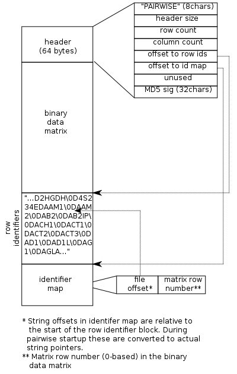
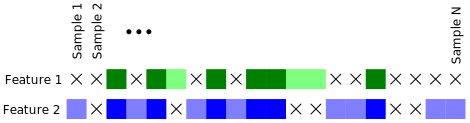

============================================================================
ABOUT
============================================================================

This software consists of two parts:

	1. A Python (Python3) preprocessing script (prep.py)
	2. A compiled (C/C++) executable (pairwise).

The pairwise executable relies on a particular binary format produced by the Python script.
**The pairwise executable cannot be run on anything but the output of prep.py.**

This software has four high-level functions:

	1. It (optionally) selects pairs of features (rows) from a preprocessed binary matrix.
		By default it iterates through *all* pairs.
	2. For every pair of features in computes several statistics 
		according to the types of features (numeric/continuous vs. categorical/discrete).
	3. It emits in a specified format (at most) 1 row for every pair of features analyzed
		subject to specified filter(s).
	4. It (optionally) carries out Benjamini-Hochberg FDR conrol.

The input matrix may contain arbitrary amounts of missing data.

----------------------------
Preprocessing
----------------------------

The prep.py preprocesses a text matrix in "TCGA" format to:

	1. validate data types and detect univariate degeneracies
	2. flag missing data in a uniform way
	3. convert categorical labels to integer labels
	4. and checking for gross violations of assumptions

...all so C code doesn't have to.

The following summarizes the product of the prep.py script.

The format of the "binary data matrix" block is documented in prep.py.

-------------
Row selection
-------------

On any given execution pairwise either calculates the statistics exhaustively
on the N-choose-2 row pairs (in the "natural" order), or it subselects row pairs:

	1. ...specified by a pair of range expressions in row numbers.
	2. ...specified as name pairs

See the online help for details.

----------
Statistics
----------

Three separate statistics are computed for each pair of features.
One of the following is calculated *between* the features using only 
those samples present in both features.

======================= ================================
Features                Statistic
======================= ================================
categorical/categorical Chisquare or Fisher Exact
categorical/numerical   Kruskal-Wallis
numerical/numerical     Spearman correlation
======================= ================================

Kruskal-Wallis is a non-parametric analog of 1-way ANOVA, 
which is approximately Chi-square distributed. The Spearman
correlation is the same as Pearson correlation but is calculated
on the ranks, not actual values, of the data.

Additionally, *within* each feature (F) the Kruskal-Wallis statistic is calculated 
between the samples of F present in both and samples present in F but missing in "the other."
For example, in the figure below where 'X' indicates missing data, 
the Kruskal-Wallis statistic is calculated in Feature 1 
between the light green and dark green samples and in Feature 2 between the light
blue and dark blue samples. The primary statistic (whichever of the above is used)
is calculated between the dark blue and dark green.

The K-W statistic *within* each feature provides some indication of whether 
the statistical result *between* the features was skewed by missing data.

The Spearman correlation is calculated for numeric pairs as well as when
all categorical features are *binary* (i.e. between a numeric feature and a binary
categorical or between two binary categorical).

The case where both features are categorical is slightly more
complex. In the interest of having statistically "good" tables
a preprocessing step is performed in which rows and/or columns
with empty cells are removed in such a way as to minimize the
total loss of samples. The approach, however, is greedy and not
guaranteed to be optimal. If after this "culling" step either of
the table's dimensions exceeds 2, a Chi-Square test is performed. 
Otherwise, if the table is 2x2, the Fisher exact test is performed.

------------------------
Filtering and formatting
------------------------

See pairwise' online help for reporting/formatting options. 
This is unresolved and in flux.

----------------------------
False discovery rate control
----------------------------

This is implemented but untested.

^^^^

============================================================================
BUILDING
============================================================================

Dependencies:
	GNU Scientific Library (GSL_) 

Update the Makefile's GSLINC and GSLLIB variables with the location of
GSL's headers and libraries on your system.

Running::

	make
	
...in the src directory on a Linux machine with a suitable 
development environment builds the pairwise executable. 

.. _GSL: http://www.gnu.org/software/gsl

^^^^

============================================================================
TESTING
============================================================================

C code is structured as much as possible in unit-testable modules.
All unit testable C code has a conditionally compiled main() in its tail
to facilitate unit testing. See the relevant files and Makefile.
The unit tests are not automated; they are command line apps that are
intended for manual verification.

A blackbox testing framework is also provided in test/blackbox.
The exec.py script in test/blackbox:

	1. generates random data in R 
	2. analyzes the data in R
	3. preprocesses (using prep.py) and analyzes the data in pairwise
	4. compares the results of the two data paths.

It is run simply as::

	python3 exec.py <# of tests to perform>.

Note that for the case of categorical/categorical covariates
this involved a non-trivial reimplemention in R of the C++ "culling" code
in cat.cpp

^^^^

============================================================================
USAGE
============================================================================

Run the tools as::

	python3 prep.py yourdata.tab 

	./pairwise-1.3.0 yourdata.bin 

Many command line options are available. See::

	python3 prep.py --help

...and run pairwise with no arguments.

^^^^

============================================================================
LIMITATIONS
============================================================================

1. No categorical feature may have more than 32 categories.
2. Because of the (very unfortunate) decision to use 32-bit offsets in the
	header, the binary file produced by prep.py must not exceed 4GB.
3. The commandline row selection specification must not exceed 1024 chars.

^^^^

============================================================================
OPEN ISSUES/TODO/WISHLIST
============================================================================

----------------------------------------------------------------------------
Formatting/reporting
----------------------------------------------------------------------------

The "ABOUT" section at the top paints a happier picture of things than
actually exists right now.

*How* statistical results are emitted (the format) needs to be more cleanly
separated from *what* is reported (filtering)...and, more importantly, what 
is "done" with results not reported. See below.

----------------------------------------------------------------------------
Reporting/filtering/counting of tests
----------------------------------------------------------------------------

Computation of statistics can fail for a variety of reasons related to
degeneracies in the input data. Some of these can be detected early (before
computation); some only become apparent in the coarse of computation.

Handling of degeneracies is furthermore bound up with three different
requirements that are somewhat at odds:
1. maximizing useful output, "useful" being context-dependent.
2. the need to filter output (i.e. to avoid a combinatoric explosion
of "uninteresting" results)
3. the need to count actually performed tests (for FDR control)

The typical sparsity of "interesting" results in the N-choose-2 possibilities
demands some in-program filtering (as opposed to simply piping the output
through a shell filter like awk), but there are multiple ways one
might filter. Only p-value filtering is currently available.

The need to support FDR control requires clear distinction between tests
*not performed* (e.g. because of early degeneracy detection) and failed
tests.

Proper handling of these issues is not fully resolved in the current 
implementation. 

Currently, NaNs are *intentionally* allowed to propagate to output; this is 
not a bug.

----------------------------------------------------------------------------
Row subselection
----------------------------------------------------------------------------

Iteration scheme is inelegant, but at least it is cleanly encapsulated 
(quarantined!) in iter.c. It's easily replaced.

============================================================================
DESIGN
============================================================================

----------------------------------------------------------------------------
Goals
----------------------------------------------------------------------------

This software began as a reimplementation of an existing pipeline.
The requirement for compatibility with the prototype drove much
of its design.

The original program was motivated by one goal: speed...specifically, 
fast calculation of the several standard statistics describe above
on input with significant amounts of missing data. 

It was originally intended strictly for *exhaustive pairwise batch 
processing*.  Everything that deviates from this, e.g. row subselection, is 
an afterthought/add-on.

The goal of speed is approached in three ways:

	1. Elimination of as much runtime redundancy as possible (preprocessing)
	2. No memory allocation within loops; all memory is allocated before iteration commences.
	3. Implementation in a compiled language

----------------------------------------------------------------------------
Degeneracy handling
----------------------------------------------------------------------------

Two types of degeneracies occur:
	1) those inherent in one (or both) *univariate* features
		a) categorical data with < 2 categories
		b) numerical data that is constant
	2) those that only emerge in the covariate pair because missing
		data in one feature forces exclusion of values in the other

The preprocessor detects univariate degeneracies.
Pairwise detects covariate degeneracies and halts all computations.

